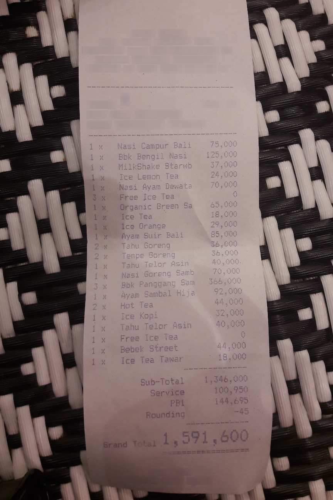

# 🧾 Agentic Receipt Query System

Ask questions about receipt purchases using a locally fine-tuned receipt parser, semantic search with Qdrant, and a local Qwen model.

---

## 🧭 Overview

The project has two connected flows:

1. **Receipt ingestion:** an image is parsed into structured receipt data, embedded, and stored in Qdrant.
2. **Question answering:** Qwen decides whether a question needs receipt data. If it does, the Python search tool retrieves matching receipts from Qdrant and returns their payloads to Qwen for an answer.

General questions can be answered by Qwen without searching receipts. Receipt questions require Qdrant to be running.

---

## 🧠 Models and Services

| Component | Model or service | Role |
| --- | --- | --- |
| Receipt extraction | Fine-tuned Donut checkpoint at `model/extracted/donut_cord_final_v2` | Reads a receipt image and generates structured JSON fields such as menu items, counts, prices, and totals. |
| Text embeddings | `BAAI/bge-m3` via FlagEmbedding | Encodes receipt summaries and search questions as dense vectors. The dense vectors are 1024 dimensions. |
| Vector database | Qdrant, collection `receipts` | Stores each vector with the parsed receipt JSON as its payload; searches by cosine similarity. |
| Local answer model | Ollama `qwen2.5:3b` | Answers general questions and can request the `search_receipts` tool for questions about purchases or spending. |

### Donut Training Notebook

The notebook fine-tunes a Donut vision-encoder-decoder model using CORD-V2. Its recorded training run shows 5 epochs, 4,000 steps, and a training loss of about 0.1309. Training loss is not an accuracy score and does not guarantee correct extraction on every receipt.

The Ollama tag is **Qwen 2.5 3B**: “3B” refers to the model's approximate parameter count, not its exact RAM or disk usage. It is not a “Q5” model designation. Actual resource use depends on the Ollama model quantization and the rest of the workload.

---

## 📸 Example Receipt



Example question: **What is the grand total on this receipt?**

Example answer from the visible receipt: **1,591,600**. This is a manually read illustration, not a claim that the OCR pipeline produced this exact result.

---

## 🗂️ Project Files

| File or folder | Purpose |
| --- | --- |
| `Notebook/agentic__receipt_query_system.ipynb` | Explores CORD-V2 and fine-tunes the Donut receipt model. |
| `pipeline.py` | Extracts a receipt image with Donut, creates an embedding, and upserts the parsed JSON into Qdrant. |
| `receipt_to_text.py` | Converts parsed menu items and totals into text for embedding. |
| `setup_collection.py` | Creates the Qdrant `receipts` collection with 1024-dimensional cosine vectors. Run once for a new database. |
| `receipt_agent_loop.py` | Interactive Qwen agent with an optional Qdrant receipt-search tool. |
| `run_pipeline_test.py` | Runs the image-to-Qdrant pipeline using `assets/receipt_example.jpg`. |
| `retrive_test.py` | Standalone semantic-search test. |
| `store_receipt.py`, `store_firstpoint.py` | Example scripts for inserting receipt payloads into Qdrant. |
| `assets/` | Sample receipt images. |

---

## ⚙️ Setup

### Requirements

- Python and the project dependencies
- Docker Desktop with Docker Engine running for Qdrant
- Ollama installed, with the `qwen2.5:3b` model pulled
- The local Donut checkpoint in `model/extracted/donut_cord_final_v2` for image ingestion

Create and activate the virtual environment in PowerShell, then install the packages used by the scripts:

```powershell
python -m venv venv
.\venv\Scripts\Activate.ps1
python -m pip install torch transformers pillow qdrant-client FlagEmbedding requests
```

Install Ollama separately and pull the answer model:

```powershell
ollama pull qwen2.5:3b
```

Start Qdrant from the project directory. The mounted folder persists Qdrant data locally:

```powershell
docker run --name qdrant -p 6333:6333 -p 6334:6334 -v "${PWD}/qdrant_storage:/qdrant/storage" qdrant/qdrant
```

For later starts, use `docker start qdrant`. Create the collection once before inserting receipts:

```powershell
python setup_collection.py
```

The trained Donut model and Qdrant database are local assets and are ignored by Git. They are not downloaded by the setup commands above. Place the trained checkpoint at the path shown above before running image ingestion.

---

## ▶️ Run the Pipeline

With Qdrant running and the trained Donut checkpoint available, ingest the sample image:

```powershell
python run_pipeline_test.py
```

Then start the interactive question loop:

```powershell
python receipt_agent_loop.py
```

Ask general questions directly, or ask about a purchase, for example: `How much did I spend on pizza?`. Type `exit` or `quit` to leave.

---

## ⚠️ Current Behavior and Limitations

- Receipt search uses semantic similarity and returns up to five nearest points; it is not a full-database accounting query or guaranteed sum across all receipts.
- The current agent performs one search and one answer attempt. It has no sufficiency evaluation or retry loop, keeping local inference lighter.
- Small local models and OCR can misread receipt text or produce unsupported answers. Verify important amounts against the source receipt and retrieved Qdrant payload.
- Receipt questions require Qdrant and stored receipt points. General questions do not require Qdrant.
- This repository is a local script-based prototype; it does not currently include a FastAPI service or Docker Compose deployment for the Python application.

---

## 🔒 Data and GitHub

The `.gitignore` excludes `model/`, `qdrant_storage/`, and `venv/`. The trained weights, downloaded Ollama models, and local Qdrant data are not part of the GitHub source. Keep private or sensitive receipts out of public repositories.

---

<p align="center"><sub>Local receipt understanding, semantic search, and question answering.</sub></p>